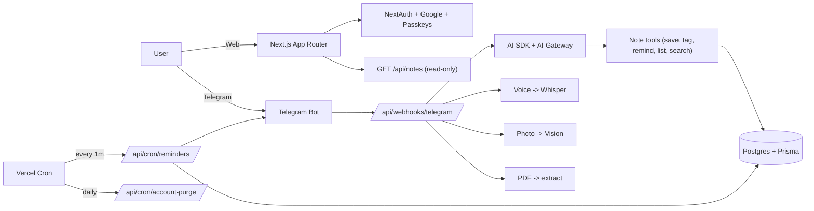

<div align="center">


# Will

### Tell Will what you will. Will remembers.

**A Telegram-first, open-source note-taking AI assistant.**
Send a message, a voice note, a photo, or a PDF — Will saves it, suggests tags, and pings you back when a reminder is due.

[](./LICENSE)
[](https://nextjs.org)
[](./CONTRIBUTING.md)

**[Live](https://will.trefolio.com)** · **[Quick start](#-quick-start)** · **[Environment](#%EF%B8%8F-environment-variables)** · **[Deploy](#%EF%B8%8F-deploy)** · **[About the name](#-about-the-name)**

</div>

---

## Two messages

> **You** _(via Telegram)_: Mum's birthday is on the 17th. Buy flowers the day before.
>
> **Will**: Saved. I added the tag `#reminder` and scheduled a ping for **May 16, 09:00**. Want to add `#mum` too? `[Yes] [No]`
>
> **You**: yes
>
> **Will**: Done.

No app to open. No menus. No spreadsheet.

---

## What Will does

| | |
|---|---|
| **Telegram-first** | Most usage happens in Telegram. Text, voice (Whisper), photos (vision), PDFs — Will normalises everything to a note. |
| **Active reminders** | When a note has a date/time intent, Will offers to schedule a Telegram ping. A cron dispatches due reminders every minute. |
| **AI tagging** | Every new note triggers a one-tap tag suggestion ("Want to tag this as `#idea` `#shopping` `#reminder`?"). |
| **Daily journal on the web** | Sign in to see your notes grouped by day, in creation order. Read-only — all writes happen in chat. |
| **Multilingual agent** | English (default), Spanish, Portuguese, Arabic. The web UI stays English; the bot replies in your preferred language. |
| **Privacy-first** | GDPR-compliant. Soft-delete with 30-day grace, full data export, no third-party trackers. MIT-licensed. |
| **Self-hostable** | Plain Next.js + Postgres on Vercel + Neon. All optional integrations (Telegram, Resend, Upstash, AI Gateway, Blob) degrade gracefully. |

---

## Quick start

> **Prerequisites:** Node.js 22+, npm, PostgreSQL 14+ (or Neon).

```bash
# 1. Clone
git clone https://github.com/kyberis/notetaker.git
cd notetaker

# 2. Install
npm install

# 3. Configure
cp .env.example .env.local
# fill in DATABASE_URL, NEXTAUTH_SECRET, OPENAI_API_KEY (minimum)

# 4. Push schema (creates tables in your local DB)
npm run prisma:sync

# 5. Run
npm run dev
```

Open <http://localhost:3000> and create an account. To enable the Telegram channel, also fill `TELEGRAM_BOT_TOKEN`, `TELEGRAM_BOT_USERNAME`, `TELEGRAM_WEBHOOK_SECRET`, deploy, then `npm run telegram:webhook`.

---

## Environment variables

See [`.env.example`](.env.example) for the full list, grouped into:

1. **Core** (required): `DATABASE_URL`, `NEXTAUTH_URL`, `NEXTAUTH_SECRET`, `APP_BASE_URL`.
2. **AI** (required): `OPENAI_API_KEY` (always — Whisper / TTS use it directly), and either Vercel AI Gateway via `vercel env pull` or `AI_GATEWAY_API_KEY`.
3. **Telegram** (optional): `TELEGRAM_BOT_TOKEN`, `TELEGRAM_BOT_USERNAME`, `TELEGRAM_WEBHOOK_SECRET`, `TELEGRAM_WEBHOOK_URL`, `TELEGRAM_LINK_TOKEN_SECRET`.
4. **Google sign-in** (optional): `GOOGLE_CLIENT_ID`, `GOOGLE_CLIENT_SECRET`.
5. **Email** (recommended in prod): `RESEND_API_KEY`, `RESEND_FROM_ADDRESS`, `APP_SESSION_SECRET`.
6. **Rate limiting** (recommended): `UPSTASH_REDIS_REST_URL`, `UPSTASH_REDIS_REST_TOKEN`.
7. **TTS** (optional): `BLOB_READ_WRITE_TOKEN`.
8. **Captcha** (optional): `NEXT_PUBLIC_TURNSTILE_SITE_KEY`, `TURNSTILE_SECRET_KEY`.
9. **Cron** (required on Vercel): `CRON_SECRET`.

---

## Architecture



---

## Repository layout

```
src/
  app/
    (app)/             Authenticated shell (notes by day, settings)
    (auth)/            Login / register / verify-email / accept-terms
    (marketing)/       Public landing, privacy, terms, FAQ, contact
    api/               REST handlers — every one wrapped in withApi()
  components/{ui, notes}
  lib/
    ai/                Agent loop, tools, transcribe, TTS, vision, prompts
    auth/              NextAuth config, password helpers, session helpers
    telegram/          Bot API client, link codes, formatter
    notes/             Note + tag persistence, day-bucket helper
    reminders/         Schedule + dispatch
    mail/              Resend wrappers + verification token signing
    i18n/              Locale primitives, dictionaries (en/es/pt/ar)
    blob/              Vercel Blob TTS upload
    db.ts              Prisma client singleton
    http.ts            withApi() wrapper for route handlers
    log.ts             Structured JSON logger
    legal.ts           Terms + Privacy version
    marketing-content.ts  Public copy + changelog (single source of truth)
prisma/                Schema + migrations
scripts/               One-off scripts (telegram webhook register)
docs/                  LinkedIn launch posts, screenshots
```

---

## Deploy

### Vercel + Neon (recommended)

1. Create a Neon Postgres. Use the **pooled** connection URL.
2. Import the repo in Vercel and set env vars from sections 1–2 of `.env.example`.
3. `vercel link` locally so `VERCEL_OIDC_TOKEN` is provisioned for AI Gateway.
4. Deploy. Production deploys run `prisma db push` automatically (see `prisma:sync` in `package.json`).
5. Add a custom domain (e.g. `will.trefolio.com`) and update `NEXTAUTH_URL` + `APP_BASE_URL` + `NEXT_PUBLIC_APP_URL`.
6. Configure Telegram bot via `npm run telegram:webhook` (after `TELEGRAM_WEBHOOK_URL` is set).

### Self-host

Plain Next.js 15 + Postgres. Runs on Fly.io / Railway / Render / Coolify / any VPS with Node 22.

---

## About the name

**Will** is the diminutive of **William Shakespeare**. It's a deliberate double meaning: "will" as the name of the world's most famous note-taker (the marginalia of the First Folio kept English prose alive), and "will" as in *intention* — what you wish to remember and act on. The default tagline ("What you will") is the alternate title of *Twelfth Night*.

The product is owned and maintained by [trefolio.com](https://trefolio.com), the same maintainer behind [Clara](https://github.com/kyberis/etracker), an open-source personal-finance assistant. Will and Clara share a tech spine but live in independent repos and Vercel deploys.

---

## Contributing

PRs welcome. Read [`CONTRIBUTING.md`](./CONTRIBUTING.md) and the [`Code of Conduct`](./CODE_OF_CONDUCT.md). Bug reports go to [GitHub Issues](https://github.com/kyberis/notetaker/issues).

---

## Licence

[MIT](./LICENSE) — do whatever you want, just don't blame us if you forget your mum's birthday.
